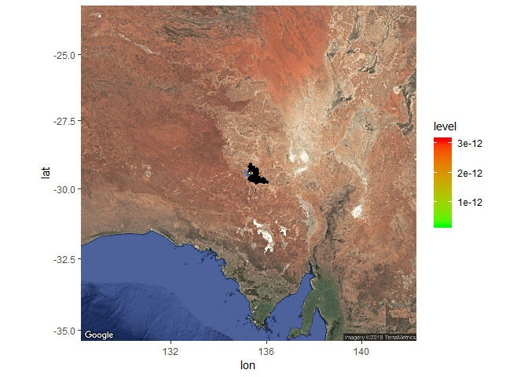
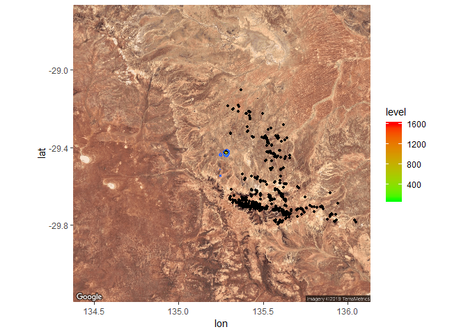
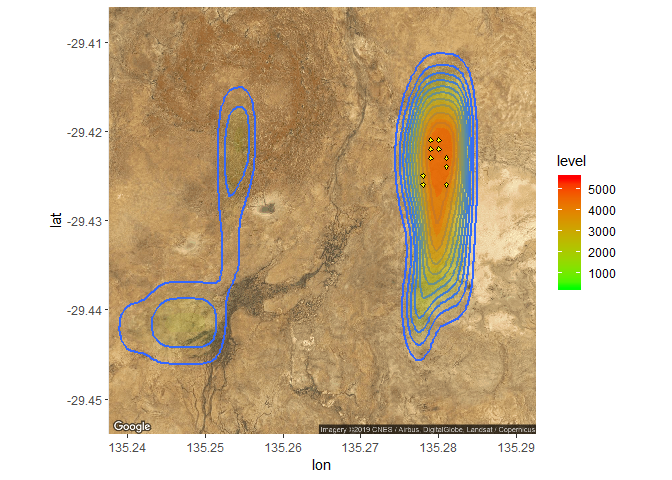
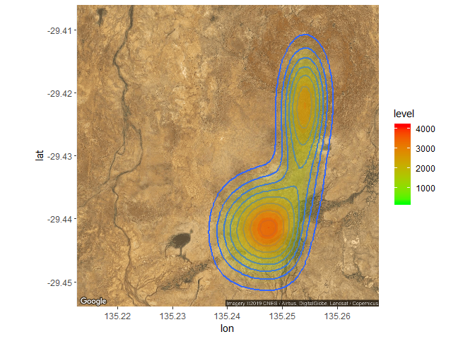
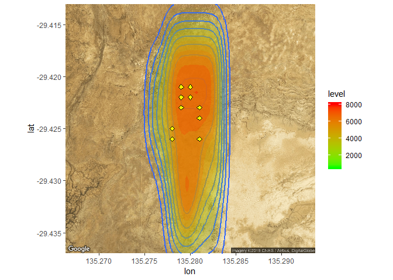
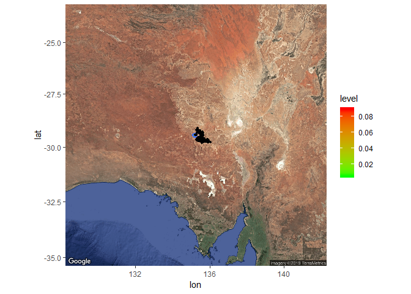
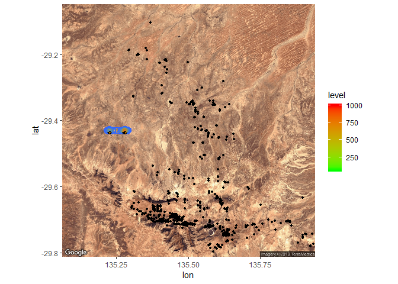
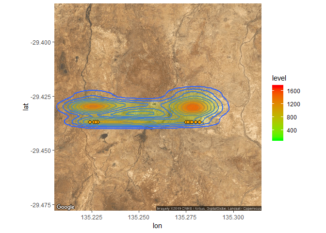
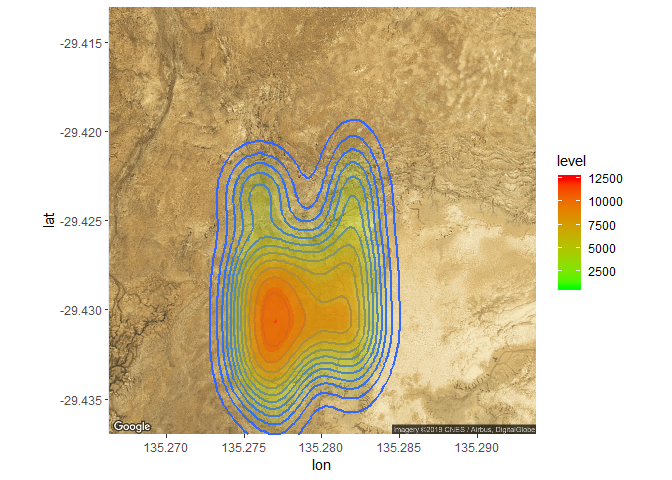

2d\_prospectivity\_map
================
Bailey
30/05/2019

## Gold Prospectivity Map

``` r
df_ds = read.csv("assays_collars_mag_gravity_all.csv")
df = read.csv("top_gold_predictions_200.csv")
df_gold_10 = read.csv("final_gold_submission.csv")


#make the primary map layer for gold deposit at Mt wood at different zooming level
map = get_map(location = c(135.255,-29.43), zoom = 6, scale = "auto",  maptype = "satellite")
```

    ## Source : https://maps.googleapis.com/maps/api/staticmap?center=-29.43,135.255&zoom=6&size=640x640&scale=2&maptype=satellite&language=en-EN&key=xxx-BA2FjpKax0xYQl1EM3X8ZmukUo95CA

``` r
ggmap(map)  + geom_density2d(aes(x = lon, y = lat), data = df, size = 1, geom="polygon")+stat_density2d(data = df,aes(x = lon, y = lat, fill = ..level.., alpha = ..level..), size = 0.01, bins = 16, geom = "polygon") + scale_fill_gradient(low = "green", high = "red") + scale_alpha(range = c(0, 0.3), guide = FALSE) +geom_point(aes(x = lon, y = lat), data = df_gold_10, size = 1, geom="polygon", shape=23, fill="yellow", color="black") + geom_point(aes(x = lon, y = lat), data = df_ds, size = 1)
```

    ## Warning: Ignoring unknown parameters: geom
    
    ## Warning: Ignoring unknown parameters: geom

<!-- -->

``` r
map = get_map(location = c(135.255,-29.43), zoom = 9, scale = "auto",  maptype = "satellite")
```

    ## Source : https://maps.googleapis.com/maps/api/staticmap?center=-29.43,135.255&zoom=9&size=640x640&scale=2&maptype=satellite&language=en-EN&key=xxx-BA2FjpKax0xYQl1EM3X8ZmukUo95CA

``` r
ggmap(map)  + geom_density2d(aes(x = lon, y = lat), data = df, size = 1, geom="polygon")+stat_density2d(data = df,aes(x = lon, y = lat, fill = ..level.., alpha = ..level..), size = 0.01, bins = 16, geom = "polygon") + scale_fill_gradient(low = "green", high = "red") + scale_alpha(range = c(0, 0.3), guide = FALSE) +geom_point(aes(x = lon, y = lat), data = df_gold_10, size = 1, geom="polygon", shape=23, fill="yellow", color="black") + geom_point(aes(x = lon, y = lat), data = df_ds, size = 1)
```

    ## Warning: Ignoring unknown parameters: geom
    
    ## Warning: Ignoring unknown parameters: geom

<!-- -->

``` r
map = get_map(location = c(135.265,-29.43), zoom = 14, scale = "auto",  maptype = "satellite")
```

    ## Source : https://maps.googleapis.com/maps/api/staticmap?center=-29.43,135.265&zoom=14&size=640x640&scale=2&maptype=satellite&language=en-EN&key=xxx-BA2FjpKax0xYQl1EM3X8ZmukUo95CA

``` r
ggmap(map)  + geom_density2d(aes(x = lon, y = lat), data = df, size = 1, geom="polygon")+stat_density2d(data = df,aes(x = lon, y = lat, fill = ..level.., alpha = ..level..), size = 0.01, bins = 16, geom = "polygon") + scale_fill_gradient(low = "green", high = "red") + scale_alpha(range = c(0, 0.3), guide = FALSE) +geom_point(aes(x = lon, y = lat), data = df_gold_10, size = 1, geom="polygon", shape=23, fill="yellow", color="black") + geom_point(aes(x = lon, y = lat), data = df_ds, size = 1)
```

    ## Warning: Ignoring unknown parameters: geom
    
    ## Warning: Ignoring unknown parameters: geom

    ## Warning: Removed 26 rows containing non-finite values (stat_density2d).
    
    ## Warning: Removed 26 rows containing non-finite values (stat_density2d).

    ## Warning: Removed 562 rows containing missing values (geom_point).

<!-- -->

``` r
map = get_map(location = c(135.24,-29.43), zoom = 14, scale = "auto",  maptype = "satellite")
```

    ## Source : https://maps.googleapis.com/maps/api/staticmap?center=-29.43,135.24&zoom=14&size=640x640&scale=2&maptype=satellite&language=en-EN&key=xxx-BA2FjpKax0xYQl1EM3X8ZmukUo95CA

``` r
ggmap(map)  + geom_density2d(aes(x = lon, y = lat), data = df, size = 1, geom="polygon")+stat_density2d(data = df,aes(x = lon, y = lat, fill = ..level.., alpha = ..level..), size = 0.01, bins = 16, geom = "polygon") + scale_fill_gradient(low = "green", high = "red") + scale_alpha(range = c(0, 0.3), guide = FALSE)
```

    ## Warning: Ignoring unknown parameters: geom

    ## Warning: Removed 162 rows containing non-finite values (stat_density2d).
    
    ## Warning: Removed 162 rows containing non-finite values (stat_density2d).

<!-- -->

``` r
map = get_map(location = c(135.28,-29.425), zoom = 15, scale = "auto",  maptype = "satellite")
```

    ## Source : https://maps.googleapis.com/maps/api/staticmap?center=-29.425,135.28&zoom=15&size=640x640&scale=2&maptype=satellite&language=en-EN&key=xxx-BA2FjpKax0xYQl1EM3X8ZmukUo95CA

``` r
ggmap(map)  + geom_density2d(aes(x = lon, y = lat), data = df, size = 1, geom="polygon")+stat_density2d(data = df,aes(x = lon, y = lat, fill = ..level.., alpha = ..level..), size = 0.01, bins = 16, geom = "polygon") + scale_fill_gradient(low = "green", high = "red") + scale_alpha(range = c(0, 0.3), guide = FALSE)+geom_point(aes(x = lon, y = lat), data = df_gold_10, size = 2, geom="polygon", shape=23, fill="yellow", color="black")
```

    ## Warning: Ignoring unknown parameters: geom

    ## Warning: Ignoring unknown parameters: geom

    ## Warning: Removed 78 rows containing non-finite values (stat_density2d).
    
    ## Warning: Removed 78 rows containing non-finite values (stat_density2d).

<!-- -->

## Copper Prospectivity Map

    ## Source : https://maps.googleapis.com/maps/api/staticmap?center=-29.43,135.255&zoom=6&size=640x640&scale=2&maptype=satellite&language=en-EN&key=xxx-BA2FjpKax0xYQl1EM3X8ZmukUo95CA

    ## Warning: Ignoring unknown parameters: geom

<!-- -->

    ## Source : https://maps.googleapis.com/maps/api/staticmap?center=-29.43,135.5&zoom=10&size=640x640&scale=2&maptype=satellite&language=en-EN&key=xxx-BA2FjpKax0xYQl1EM3X8ZmukUo95CA

    ## Warning: Ignoring unknown parameters: geom
    
    ## Warning: Ignoring unknown parameters: geom

    ## Warning: Removed 3 rows containing missing values (geom_point).

<!-- -->

    ## Source : https://maps.googleapis.com/maps/api/staticmap?center=-29.43,135.26&zoom=13&size=640x640&scale=2&maptype=satellite&language=en-EN&key=xxx-BA2FjpKax0xYQl1EM3X8ZmukUo95CA

    ## Warning: Ignoring unknown parameters: geom

    ## Warning: Ignoring unknown parameters: geom

<!-- -->

    ## Source : https://maps.googleapis.com/maps/api/staticmap?center=-29.425,135.28&zoom=15&size=640x640&scale=2&maptype=satellite&language=en-EN&key=xxx-BA2FjpKax0xYQl1EM3X8ZmukUo95CA

    ## Warning: Ignoring unknown parameters: geom

    ## Warning: Removed 124 rows containing non-finite values (stat_density2d).
    
    ## Warning: Removed 124 rows containing non-finite values (stat_density2d).

<!-- -->
